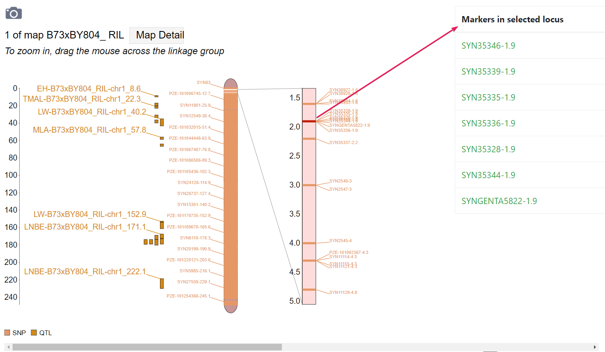

# Linkage map Visualization module for ZEAMAP

This module was modified from [**TripalMap MapViewer module**](https://gitlab.com/mainlabwsu/tripal_map) to deal with the colocalized genetic markers in ZEAMAP.

## Installation and usage

For detailed introduction, installation and usage, please refer to the original repository of [**tripal_map**](https://gitlab.com/mainlabwsu/tripal_map)

